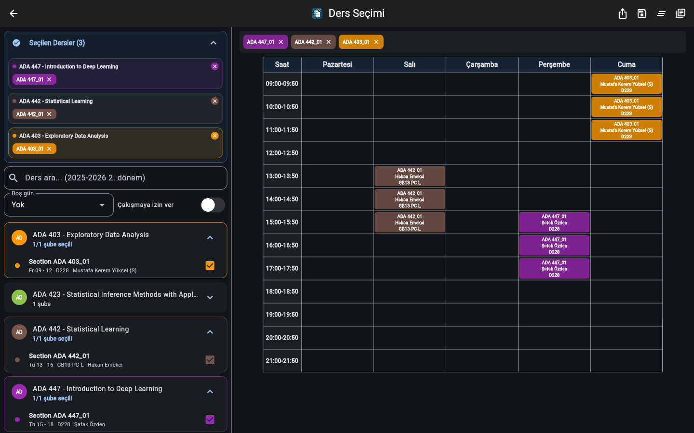
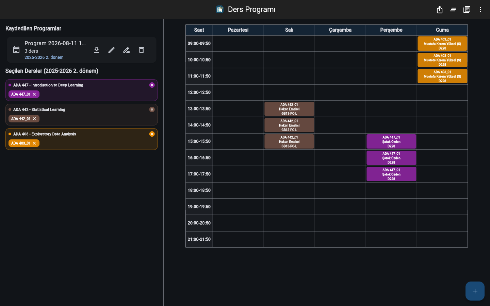
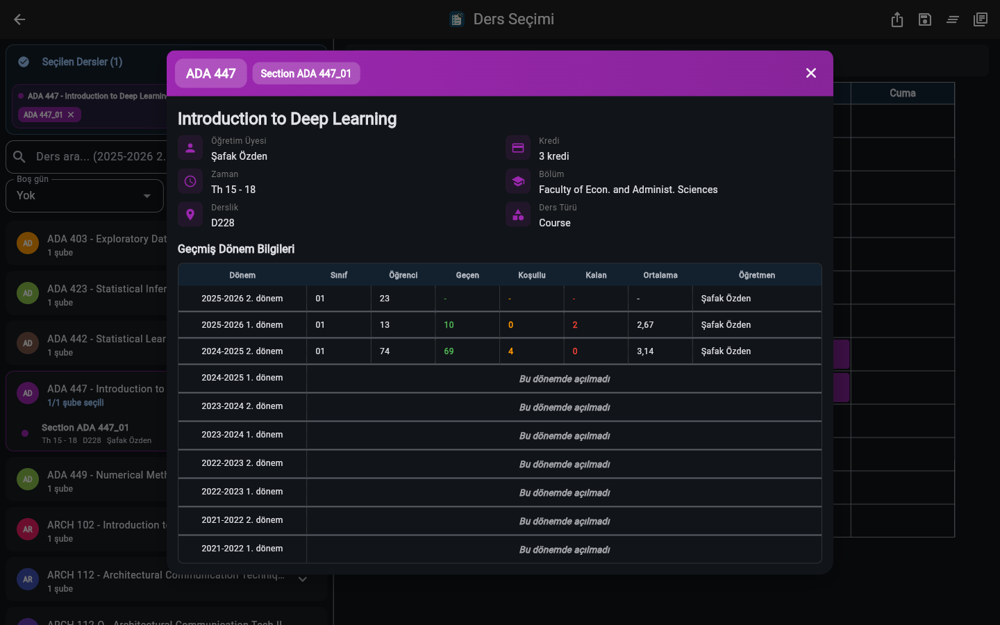
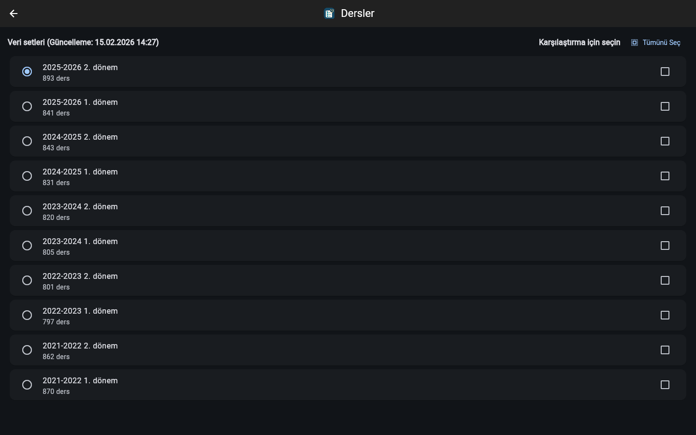

# Ders Programı Oluşturucu

Flutter ile geliştirilmiş, TEDU odaklı ders programı oluşturma uygulaması. Ders verilerini JSON varlıklarından yükler, çakışma kurallarına göre kombinasyonlar üretir, programları kaydetmenizi ve dönemler arasında ders istatistiklerini karşılaştırmanızı sağlar.

> **Not:** Bu proje resmi olmayan, bağımsız bir öğrenci projesidir; TED Üniversitesi ile herhangi bir kurumsal bağı yoktur ve üniversite tarafından desteklenmemektedir. Proje TEDU ders verisi şemasıyla uyumludur; JSON şeması sağlandığı sürece benzer veri setleriyle de çalışır.

## Özellikler

- Ders seçimi ve filtreler (kod/isim/öğretim üyesi, bölüm, çakışma izinleri, boş gün eşiği)
- Kombinasyon üretimi ve program tablosu görünümü
- Program kaydetme/güncelleme/yeniden adlandırma/silme
- Dönem karşılaştırma ve ders istatistikleri
- Dışa aktarma (metin formatı)
- Açık/Koyu/Sistem tema
- Firebase Analytics (opsiyonel, kullanıcı onayıyla)
- Firestore geri bildirim ve ders istatistikleri (opsiyonel)

## Ekran Görüntüleri

| Ders seçimi | Kayıtlı program |
| --- | --- |
|  |  |

| Ders detayı ve dönem karşılaştırması | Veri setleri |
| --- | --- |
|  |  |

## Teknoloji

- Flutter + Riverpod
- SharedPreferences
- Firebase Analytics (opsiyonel)
- Cloud Firestore (opsiyonel)
- Material 3

## Kurulum

### Gereksinimler
- Flutter (Dart 3.9+ ile uyumlu)
- Python 3.8+ (opsiyonel; veri dönüşümü için)

### Adımlar

1. Depoyu klonlayın
   ```bash
   git clone https://github.com/anilmetin0/course-scheduler.git
   cd course-scheduler
   ```
2. Bağımlılıkları kurun
   ```bash
   flutter pub get
   ```
3. Firebase konfigurasyonu (opsiyonel)
   - `.env.example` dosyasını `.env` olarak kopyalayın ve değerleri doldurun.
   - Web build için `firebase_config.env` dosyasını oluşturun (aynı anahtarlarla).
   - `.env` ve `firebase_config.env` dosyaları `.gitignore` ile korunur; repoda yalnızca şablon (`.env.example`) bulunur.
   - `lib/firebase_options.dart` anahtar içermez; tüm değerleri build-time env değişkenlerinden okur.
4. Çalıştırın
   ```bash
   flutter run
   ```
   Web için:
   ```bash
   flutter run -d chrome --dart-define-from-file=firebase_config.env \
     --dart-define=GIT_SHA=$(git rev-parse --short HEAD)
   ```

### Web build

```bash
./build_dev.sh        # WASM dev build
./build_production.sh # WASM release build
./build_js_only.sh    # JS-only release build
```

### Web build (Windows PowerShell)

```powershell
.\build_dev.ps1        # WASM dev build
.\build_production.ps1 # WASM release build
.\build_js_only.ps1    # JS-only release build
```

If PowerShell blocks script execution:
```powershell
powershell -ExecutionPolicy Bypass -File .\build_dev.ps1
```

## Dağıtım (Firebase Hosting)

```bash
./build_production.sh
firebase deploy --project course-scheduler-25
```

`firebase.json` tek sayfa yönlendirme ve servis çalışanı (SW) dosyalarına “no-cache” başlıkları ile yapılandırılmıştır. `web/index.html` ilk SW güncellemesinde otomatik yenileme içerir.

Not: `.firebaserc` repoda tutulmaz. Kendi Firebase projenizi seçmek için:
```bash
firebase use --add
```

## Veri Setleri

### Konum
`assets/schedules/` altındaki `.json` dosyaları yüklenir.

### Dosya adı kuralı
`YYYY-YYYY_NNN.json` (örn. `2024-2025_001.json`).

### Zorunlu alanlar
- `Code`, `Name`, `Section`, `Schedule`

### Opsiyonel alanlar
- `Year`, `Period`, `Dept.`, `Lecturer`, `Room`, `Cr`, `ECTS`, `Category`, `# of Students`, `Staff ID`, `Average`, vb.
- `metadata` (opsiyonel): `total_courses`, `columns`, `source`

### Schedule formatı
Örnekler:
- `Tu 13 - 15`
- `Tu/Fr 09 - 12`
- `Tu 13 - 15 We 16 - 18`

### Örnekler
`assets/schedules/example_past.json` ve `assets/schedules/example_future.json` tamamen örnektir; gerçek kişi/kurum verisi içermez.

## Excel/CSV/TSV/XML -> JSON

Uygulama doğrudan Excel okumaz; JSON varlıklarını kullanır. Dönüşüm için `convert_excel_to_json.py` kullanılabilir.

1. Python bağımlılıklarını kurun:
   ```bash
   pip install -r requirements.txt
   ```
2. Kaynak dosyayı `assets/schedules/` içine kopyalayın (`.xls`, `.xlsx`, `.csv`, `.tsv`, `.xml`).
   - `.xml` için desteklenen format: Excel 2003 XML (SpreadsheetML).
   - Farklı bir XML formatınız varsa önce CSV/TSV olarak dışa aktarın.
   - İlk satır başlık kabul edilir; kolon adları JSON anahtarlarına dönüşür.
3. Çalıştırın:
   ```bash
   python convert_excel_to_json.py
   ```
4. Çıktı: Aynı adda `.json` dosyası `assets/schedules/` altına yazılır.

## Gizlilik ve KVKK

- Analytics ve ders istatistikleri yalnızca kullanıcı onayıyla toplanır.
- Veriler anonim/özet seviyededir.
- Geri bildirim mesajları Firestore’da saklanır; kişisel bilgi yazmamanız önerilir.
- Uygulama kimlik bilgisi istemez.

### Firestore koleksiyonları
- `feedback`: `message`, `createdAt`, `locale`, `platform`, `appVersion`
- `course_stats`: `addedCount`, `removedCount`, `conflictCount`, `last*At` + ders meta bilgisi

## Test

```bash
flutter test
```

## Sorun Giderme

- Geri bildirim Firestore’a yazmıyor: Web build `--dart-define-from-file=firebase_config.env` ile yapılmalı; Firebase init hatası varsa yazma başarısız olur.
- Analytics/istatistik görünmüyor: Kullanıcı onayı kapalıysa kayıt yapılmaz.
- Yetki hatası: Firestore rules veya proje konfigürasyonunu kontrol edin.
- Firebase kurulu değilse: Uygulama çalışır; geri bildirim ve analytics devre dışı kalır.

## Lisans

Bu proje [MIT lisansı](LICENSE) ile lisanslanmıştır.
